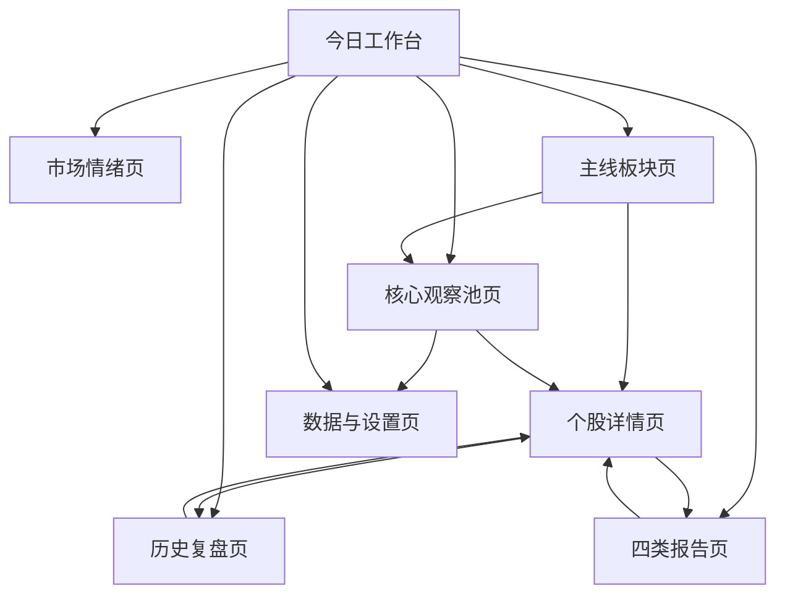

# A股深圳主板交易观察网页设计文档

版本：v0.1  
日期：2026-07-14  
阶段：需求分析、产品设计、技术架构设计  
范围：个人使用的 A 股深圳主板交易观察网页。本文档仅做设计，不包含代码实现、项目初始化或依赖安装。

## 0. 设计边界与默认假设

### 0.1 明确范围

- 只关注 A 股深圳主板股票。
- 股票代码仅允许 `000`、`001`、`002` 开头的 6 位代码。
- 不纳入创业板、科创板、北交所、港股、ETF、可转债、基金。
- 同时支持短线交易观察和中线趋势交易观察。
- 系统长期维护 20 只核心观察股。
- 每天最多选出 1 只 A 级机会、2 只 B 级机会。
- 如果没有满足买点条件的机会，首页必须清晰显示“今日不开仓”。
- 系统只做辅助分析，不连接券商，不自动下单。

### 0.2 第一阶段假设

- 第一阶段只使用模拟数据，模拟数据也必须带有明确的 `数据更新时间` 和 `数据来源=Mock`。
- 所有评分、价位、信号均由确定性算法计算。
- 大模型如果后续接入，只能用于解释、摘要、报告润色和风险提示归纳，不能直接生成建仓价、止损位、目标位或最终买卖信号。
- 第一阶段可以先做单用户本地使用，不设计登录、权限、多人协同。

### 0.3 参考依据

- 深交所官网提供股票列表、市场数据、上市公司公告等入口，可作为后续真实行情和公告来源校验的官方参考：[深交所股票列表](https://www.szse.cn/market/product/stock/list/index.html)、[深交所官网](https://www.szse.cn/index/index.html)。
- 投资者风险揭示和适当性意识参考中国证监会《证券期货投资者适当性管理办法》：[证监会页面](https://www.csrc.gov.cn/csrc/c106256/c1653849/content.shtml)。

## 1. 产品页面结构

### 1.1 总体导航

采用工作台式结构，而不是营销页结构。左侧为主导航，顶部为交易日状态和数据健康状态，主体区域展示当日可操作信息。

主导航建议：

1. 今日工作台
2. 市场情绪
3. 主线板块
4. 核心观察池
5. 个股详情
6. 四类报告
7. 历史复盘
8. 数据与设置

### 1.2 今日工作台

定位：开盘前、盘中、收盘后最常看的总控页面。

核心模块：

- 今日结论：显示 `A级机会 0/1`、`B级机会 0-2/2`，如果没有合格买点，显示“今日不开仓”。
- 市场情绪评分：显示总分、等级、变化方向、主要扣分项。
- 主线板块 Top 5：显示板块名称、强度分、持续性、龙头股、风险标签。
- 今日候选机会：最多展示 1 只 A 级、2 只 B 级，按短线机会优先排序。
- 核心观察池摘要：20 只股票的短线评级、中线评级、操作信号、数据状态。
- 风险警报：重大公告、异常波动、数据过期、涨停追高、跌破止损等。
- 数据更新时间：页面级更新时间和每个行情模块自己的更新时间。

### 1.3 市场情绪页

定位：判断今天是否适合开仓，以及适合激进、轻仓还是不开仓。

核心模块：

- 情绪总分：0-100。
- 情绪等级：冰点、弱修复、中性、强势、过热。
- 组成指标：涨跌家数、涨停/跌停数量、连板高度、成交额变化、指数位置、北向或替代资金指标、主线集中度。
- 情绪时序图：保存每日情绪分，便于复盘。
- 开仓环境建议：可开仓、轻仓试错、只做持仓管理、不开新仓。
- 异常提示：如果行情数据不完整或延迟，情绪分标记为“不可用”或“仅供离线复盘”。

### 1.4 主线板块页

定位：识别短线资金主攻方向和中线趋势板块。

核心模块：

- 板块排行榜：板块强度分、涨幅、成交额变化、涨停数量、核心个股贡献。
- 板块持续性：1 日、3 日、5 日强度排名变化。
- 板块拥挤度：过热、正常、低位启动。
- 板块与观察池关联：20 只核心股中哪些属于当前主线。
- 板块风险：高位分歧、消息兑现、成交放大但价格滞涨。

### 1.5 核心观察池页

定位：长期维护 20 只核心观察股。

核心模块：

- 20 只股票表格：代码、名称、行业/板块、现价、涨跌幅、成交额、量比、换手率。
- 短线评级：A、B、C、D、禁入。
- 中线评级：强趋势、趋势保持、震荡观察、趋势破坏、禁入。
- 操作信号：可以买、等回踩、持股、减仓、不碰。
- 建仓区与风控：第一建仓区、第二建仓区、放弃追高价、止损位、第一目标位、第二目标位。
- 主升浪阶段：蓄势、突破、主升、加速、分歧、退潮。
- 数据状态：实时、延迟、过期、缺失、异常。
- 管理动作：加入候选、移出核心池、替换记录、查看历史。

### 1.6 个股详情页

定位：解释为什么这只股票是这个评级和这个价位。

核心模块：

- 行情摘要：现价、涨跌幅、成交额、量比、换手率、更新时间。
- 短线评分拆解：每个因子得分、权重、扣分原因。
- 中线评分拆解：趋势、相对强度、量价结构、风险项。
- 交易计划：第一建仓区、第二建仓区、放弃追高价、止损位、目标位。
- 量价结构：关键均线、ATR、近期平台、突破价、回踩位。
- 主升浪阶段判断：阶段、依据、阶段变化历史。
- 公告与新闻：重要公告、新闻催化、风险预警。
- 历史信号：最近 30/60/120 个交易日的评级与信号变化。

### 1.7 四类报告页

定位：按交易日节奏沉淀分析结果。

报告类型：

- 盘前报告：交易日计划、观察重点、候选机会、不开仓条件。
- 竞价报告：集合竞价强弱、是否确认买点、是否取消候选。
- 盘中报告：情绪变化、机会触发、止损/减仓提示。
- 盘后报告：评分复盘、信号复盘、观察池调整建议。

报告要求：

- 每份报告必须记录生成时间、使用数据时间、数据来源、数据健康状态。
- 报告中引用的价位必须来自算法输出，不允许人工或大模型随意生成。
- 如果数据过期，报告标题必须标记“数据过期，不作实时参考”。

### 1.8 历史复盘页

定位：验证评分模型是否稳定、可解释、可复现。

核心模块：

- 历史市场情绪分。
- 历史短线/中线评分。
- 历史操作信号。
- 历史建仓区、止损位、目标位。
- 观察池变化记录。
- 候选机会命中统计：A/B 候选后续 1 日、3 日、5 日表现。
- 模型版本对比：评分模型调整后可以区分不同版本。

### 1.9 数据与设置页

定位：管理数据源、更新状态、观察池规则和算法参数。

核心模块：

- 数据源状态：Mock、真实行情源、公告源、新闻源。
- API 密钥状态：只显示是否配置，不显示密钥内容。
- 更新时间规则：盘前、竞价、盘中、盘后。
- 数据异常规则：过期阈值、缺失阈值、异常波动阈值。
- 观察池规则：20 只上限、代码校验、替换原因必填。
- 算法参数版本：评分权重、ATR 参数、建仓区参数、止损参数。

## 2. 页面之间的跳转关系

典型用户路径：

1. 盘前：今日工作台 -> 盘前报告 -> 核心观察池 -> 个股详情。
2. 竞价：今日工作台 -> 竞价报告 -> 候选个股详情。
3. 盘中：今日工作台 -> 市场情绪 -> 主线板块 -> 个股详情。
4. 盘后：今日工作台 -> 盘后报告 -> 历史复盘 -> 观察池调整。

## 3. 系统架构

### 3.1 总体架构

目标技术栈：

- 前端：Next.js、TypeScript、Tailwind CSS。
- 第一阶段：模拟数据驱动页面。
- 第二阶段：接入真实行情、公告、新闻。
- 行情接口：独立封装，前端不直接依赖具体供应商。
- API 密钥：只允许保存在环境变量中。

分层设计：

1. 页面层
   - 负责布局、表格、图表、交互、状态展示。
   - 不直接计算核心交易结论。

2. 应用服务层
   - 组织页面需要的数据。
   - 合并行情、板块、公告、新闻、历史记录。
   - 负责报告生成流程编排。

3. 领域算法层
   - 市场情绪评分。
   - 板块强度评分。
   - 短线评分。
   - 中线评分。
   - 建仓区、止损位、目标位计算。
   - 操作信号判定。

4. 数据适配层
   - `MarketDataProvider`：行情数据。
   - `SectorDataProvider`：板块数据。
   - `AnnouncementProvider`：公告数据。
   - `NewsProvider`：新闻催化。
   - `StorageRepository`：历史数据和观察池变化。

5. 数据存储层
   - 第一阶段：内置模拟数据和浏览器本地状态即可。
   - 后续阶段：建议使用 SQLite 或 PostgreSQL 保存历史评分、信号、观察池变更、报告快照。

### 3.2 模块边界

行情模块只负责返回原始行情和数据健康状态，不负责交易判断。

评分模块只接受标准化后的行情、板块、公告和历史 K 线，不关心数据来自 Mock 还是真实接口。

报告模块只读取评分结果和风险提示，不重新计算价位。

UI 模块只展示计算结果，不在组件内写评分规则。

### 3.3 数据源抽象

统一数据源接口需要支持：

- 获取股票快照。
- 获取日 K 线。
- 获取分钟行情或竞价行情。
- 获取板块强度数据。
- 获取公告。
- 获取新闻。
- 返回数据时间、接收时间、来源、是否延迟、是否异常。

第一阶段的 Mock Provider 必须模拟以下情况：

- 正常实时数据。
- 延迟数据。
- 缺失字段。
- 异常跳价。
- 无合格买点，显示“今日不开仓”。

## 4. 数据结构

以下为概念结构，不是代码实现。

### 4.1 股票基础信息 StockMaster

| 字段 | 说明 |
|---|---|
| stockCode | 6 位股票代码，只允许 000、001、002 开头 |
| stockName | 股票名称 |
| exchange | 固定为 SZSE |
| board | 固定为 Shenzhen Main Board |
| industry | 行业 |
| sectorTags | 板块标签 |
| isST | 是否 ST |
| isSuspended | 是否停牌 |
| listedDate | 上市日期 |
| status | active、retired、candidate |

### 4.2 行情快照 QuoteSnapshot

| 字段 | 说明 |
|---|---|
| stockCode | 股票代码 |
| tradeDate | 交易日 |
| lastPrice | 现价 |
| prevClose | 昨收 |
| changePct | 涨跌幅 |
| amount | 成交额 |
| volumeRatio | 量比 |
| turnoverRate | 换手率 |
| high | 当日最高 |
| low | 当日最低 |
| open | 开盘价 |
| providerTime | 数据源时间 |
| receivedAt | 系统接收时间 |
| source | Mock 或真实供应商名称 |
| freshnessStatus | realtime、delayed、stale、missing、invalid |

### 4.3 K 线 DailyBar

| 字段 | 说明 |
|---|---|
| stockCode | 股票代码 |
| tradeDate | 交易日 |
| open、high、low、close | OHLC |
| volume | 成交量 |
| amount | 成交额 |
| turnoverRate | 换手率 |
| ma5、ma10、ma20、ma60 | 均线 |
| atr14 | 14 日 ATR |
| providerTime | 数据时间 |

### 4.4 观察池 WatchPoolItem

| 字段 | 说明 |
|---|---|
| stockCode | 股票代码 |
| addedAt | 加入时间 |
| addedReason | 加入原因 |
| coreRank | 1-20 的核心池排序 |
| strategyTags | shortTerm、midTerm、both |
| reviewCycle | daily、weekly |
| ownerNote | 个人备注 |
| status | active、paused、retired |

### 4.5 评分 RatingSnapshot

| 字段 | 说明 |
|---|---|
| stockCode | 股票代码 |
| tradeDate | 交易日 |
| modelVersion | 模型版本 |
| shortScore | 短线分 0-100 |
| shortRating | A、B、C、D、禁入 |
| midScore | 中线分 0-100 |
| midRating | 强趋势、趋势保持、震荡观察、趋势破坏、禁入 |
| factorBreakdown | 各因子分数、权重、扣分原因 |
| calculatedAt | 计算时间 |
| inputDataTime | 输入数据时间 |

### 4.6 交易计划 TradePlan

| 字段 | 说明 |
|---|---|
| stockCode | 股票代码 |
| tradeDate | 交易日 |
| entryZone1Low、entryZone1High | 第一建仓区 |
| entryZone2Low、entryZone2High | 第二建仓区 |
| chaseLimitPrice | 放弃追高价 |
| stopLossPrice | 止损位 |
| target1Price | 第一目标位 |
| target2Price | 第二目标位 |
| riskReward1 | 第一目标盈亏比 |
| riskReward2 | 第二目标盈亏比 |
| algorithmVersion | 价位算法版本 |
| calculatedAt | 计算时间 |

### 4.7 操作信号 SignalSnapshot

| 字段 | 说明 |
|---|---|
| stockCode | 股票代码 |
| tradeDate | 交易日 |
| signal | 可以买、等回踩、持股、减仓、不碰 |
| opportunityLevel | A、B、None |
| reasonCodes | 触发原因代码 |
| invalidationRules | 信号失效条件 |
| generatedAt | 生成时间 |
| dataFreshness | 数据健康状态 |

### 4.8 报告 ReportSnapshot

| 字段 | 说明 |
|---|---|
| reportId | 报告 ID |
| tradeDate | 交易日 |
| reportType | preMarket、auction、intraday、postMarket |
| generatedAt | 生成时间 |
| inputDataTime | 使用数据时间 |
| marketSummary | 市场摘要 |
| opportunities | A/B 候选 |
| noTradeReason | 今日不开仓原因 |
| risks | 风险提示 |
| dataHealth | 数据健康摘要 |

### 4.9 观察池变更 WatchPoolChange

| 字段 | 说明 |
|---|---|
| changeId | 变更 ID |
| changedAt | 变更时间 |
| action | add、remove、replace、pause、resume |
| stockCode | 股票代码 |
| oldStockCode | 替换时的旧代码 |
| reason | 变更原因 |
| operator | personal |

## 5. 20 只观察池的管理方式

### 5.1 核心规则

- 核心观察池 active 状态股票必须等于或少于 20 只。
- 推荐长期保持正好 20 只，方便形成稳定比较基准。
- 新增股票必须通过代码校验：6 位数字，且前三位为 `000`、`001`、`002`。
- 移出或替换必须填写原因，例如：趋势破坏、基本面风险、流动性下降、主线退潮、长期不活跃。
- 观察池变更必须保存历史，不覆盖旧记录。

### 5.2 股票状态

- active：核心观察池内，参与每日评分和候选排序。
- paused：暂不参与候选，例如停牌、重大事项未明、数据异常。
- retired：已移出观察池，仅保留历史记录。
- candidate：备选池，不占 20 只核心名额。

### 5.3 维护节奏

- 每日：只更新评分、信号、风险，不频繁换池。
- 每周：检查是否需要替换弱趋势、弱流动性、长期无机会股票。
- 每月：复盘观察池整体质量，统计 A/B 候选命中率和误报率。

### 5.4 替换机制

替换流程：

1. 候选股票进入 candidate。
2. 连续满足中线或短线质量条件至少 3 个交易日。
3. 与当前核心池尾部股票比较综合质量。
4. 如果替换，记录旧股票、原因、新股票、模型快照。

不建议自动替换。系统可以给出替换建议，但最终由用户确认。

## 6. 短线评分模型

短线模型目标：识别 1-5 个交易日内具有可操作买点的机会。

### 6.1 总分结构

总分 0-100，所有因子可解释、可复现。

| 因子 | 权重 | 说明 |
|---|---:|---|
| 市场情绪适配 | 15 | 市场是否支持短线开仓 |
| 主线板块强度 | 15 | 股票是否处于当日或近期主线 |
| 价格动量 | 15 | 突破、回踩、均线附近强弱 |
| 量能确认 | 15 | 成交额、量比、换手率是否配合 |
| 形态位置 | 15 | 是否低吸、突破初期、平台上沿，而非高位追涨 |
| 风险收益比 | 15 | 止损距离和目标空间是否合格 |
| 催化与风险 | 10 | 公告、新闻催化、负面风险 |

### 6.2 评级规则

| 分数 | 短线评级 | 含义 |
|---:|---|---|
| 85-100 | A | 强机会，但还必须落在买点区间内 |
| 75-84 | B | 可观察或轻仓机会 |
| 60-74 | C | 有关注价值，等待条件改善 |
| 40-59 | D | 暂不参与 |
| 0-39 | 禁入 | 风险过高或数据不可用 |

### 6.3 A/B 候选限制

每日候选不是简单按分数展示，而是经过闸门过滤：

1. 数据必须有效且不过期。
2. 股票必须在 active 观察池内。
3. 市场情绪不能处于极端冰点，除非策略明确为低吸试错。
4. 当前价格必须处于第一建仓区、第二建仓区，或接近可接受回踩区。
5. 当前价格高于放弃追高价时，不允许给出“可以买”。
6. 风险收益比不足时，不允许进入 A/B 候选。
7. 重大负面公告未消化时，强制降为“不碰”。

排序后：

- 最高只允许 1 只 A 级机会。
- 最多只允许 2 只 B 级机会。
- 如果没有股票同时满足评分和买点，显示“今日不开仓”。

### 6.4 操作信号映射

| 条件 | 信号 |
|---|---|
| A/B 评级，价格在建仓区，风险收益比合格 | 可以买 |
| A/B/C 评级，趋势好但价格高于建仓区低于追高价 | 等回踩 |
| 已持仓且趋势未破坏，价格未到目标/止损 | 持股 |
| 已持仓且接近目标位、放量滞涨或情绪转弱 | 减仓 |
| 数据异常、价格追高、趋势破坏、重大风险 | 不碰 |

## 7. 中线评分模型

中线模型目标：识别 2-12 周维度的趋势质量和持有价值。

### 7.1 总分结构

| 因子 | 权重 | 说明 |
|---|---:|---|
| 趋势结构 | 25 | 均线多头、价格相对 MA20/MA60 位置 |
| 相对强度 | 20 | 相对深证主板指数、所属板块的强弱 |
| 量价健康度 | 15 | 上涨放量、回调缩量、成交额稳定性 |
| 主升浪阶段 | 15 | 是否处于突破、主升，而非退潮 |
| 回撤控制 | 10 | 最大回撤、跌破关键支撑情况 |
| 板块持续性 | 10 | 所属板块 5/20 日强度延续 |
| 催化与风险 | 5 | 中期政策、业绩、公告风险 |

### 7.2 评级规则

| 分数 | 中线评级 | 含义 |
|---:|---|---|
| 85-100 | 强趋势 | 可作为中线核心观察 |
| 70-84 | 趋势保持 | 趋势仍在，但需关注回踩 |
| 55-69 | 震荡观察 | 暂无明确趋势优势 |
| 40-54 | 趋势破坏 | 中线不宜新增 |
| 0-39 | 禁入 | 数据、风险或结构明显不合格 |

### 7.3 主升浪阶段判断

| 阶段 | 判定思路 |
|---|---|
| 蓄势 | 价格围绕 MA20/MA60 震荡，成交温和 |
| 突破 | 放量突破近 20/60 日平台高点 |
| 主升 | MA5、MA10、MA20 多头，回踩不破 MA10/MA20 |
| 加速 | 连续大阳或涨停，偏离 MA20 明显扩大 |
| 分歧 | 高位放量震荡，长上影或冲高回落增多 |
| 退潮 | 跌破 MA20 或平台下沿，反弹缩量 |

中线评级不会直接等于买入信号。中线强趋势股票如果短线价格已经过热，仍然只能显示“等回踩”或“不碰”。

## 8. 建仓区和止损位计算思路

### 8.1 计算原则

- 所有价位由算法计算，使用明确输入：最新价格、近 N 日 K 线、均线、ATR、平台高低点、成交量。
- 计算结果必须保存算法版本和输入数据时间。
- 价格结果按 A 股最小报价单位 0.01 元取整。
- 如果真实行情接入后遇到涨跌停限制、停牌、ST 等特殊状态，必须进行单独校验。

### 8.2 关键输入

- `close`：最新收盘价或盘中现价。
- `MA5 / MA10 / MA20 / MA60`。
- `ATR14`：14 日平均真实波幅。
- `recentSwingLow`：近 10-20 日有效低点。
- `recentSwingHigh`：近 10-20 日有效高点。
- `breakoutPivot`：近 20/60 日平台突破价。
- `volumeProfileSupport`：成交密集区支撑，第一阶段可用近 N 日成交额加权价近似。

### 8.3 第一建仓区

适合短线回踩或突破后的第一次低吸。

计算思路：

- 候选支撑价取以下价格中的较强支撑：MA5、MA10、突破平台上沿、当日 VWAP 或近似成交均价。
- 第一建仓区下沿 = 支撑价 - 0.25 * ATR14。
- 第一建仓区上沿 = 支撑价 + 0.25 * ATR14。
- 如果当前价格已经高于第一建仓区上沿太多，则不显示“可以买”，只显示“等回踩”。

### 8.4 第二建仓区

适合更深回踩或中线趋势支撑。

计算思路：

- 候选支撑价取 MA20、近期平台下沿、recentSwingLow 上方区域。
- 第二建仓区下沿 = 深支撑价 - 0.35 * ATR14。
- 第二建仓区上沿 = 深支撑价 + 0.35 * ATR14。
- 如果第二建仓区被有效跌破，短线信号降级，中线进入复核。

### 8.5 放弃追高价

用于防止模型在情绪过热时给出追涨信号。

计算思路：

- 基准价 = max(第一建仓区上沿, breakoutPivot)。
- 放弃追高价 = 基准价 + min(0.8 * ATR14, 基准价 * 4%)。
- 如果当前价高于放弃追高价，操作信号不能是“可以买”。
- 如果股票处于加速阶段且偏离 MA20 过大，进一步降低追高容忍度。

### 8.6 止损位

止损必须在交易前确定。

计算思路：

- 短线止损候选：第二建仓区下沿 - 0.25 * ATR14。
- 结构止损候选：recentSwingLow - 0.01。
- 最终止损 = 两者中更能代表结构破坏的位置。
- 如果从计划买入价到止损位的风险超过预设阈值，例如短线 7%-8%，则不允许给出“可以买”。
- 如果止损价高于或等于建仓区下沿，说明结构异常，交易计划无效。

### 8.7 目标位

目标位结合阻力和盈亏比。

计算思路：

- 计划买入价 = 第一建仓区中位数，若触发第二建仓则用第二建仓区中位数重新计算。
- 单位风险 R = 计划买入价 - 止损位。
- 第一目标位 = max(计划买入价 + 1.5R, 近期阻力位下方)。
- 第二目标位 = max(计划买入价 + 2.5R, recentSwingHigh 或趋势通道上沿)。
- 如果第一目标位盈亏比小于 1.5，短线候选降级。

## 9. 数据更新流程

### 9.1 更新时段

| 时段 | 目标 |
|---|---|
| 盘前 | 更新公告、新闻、昨日日 K、盘前报告 |
| 竞价 | 更新集合竞价强弱、修正候选机会 |
| 盘中 | 更新行情快照、情绪分、板块强度、操作信号 |
| 盘后 | 固化评分、信号、报告、观察池复盘 |

### 9.2 第一阶段 Mock 流程

1. 加载模拟股票池和模拟行情。
2. 标准化为统一数据结构。
3. 执行数据健康检查。
4. 计算市场情绪、板块强度、个股评分。
5. 计算建仓区、止损位、目标位。
6. 生成操作信号和 A/B 候选。
7. 保存或展示历史快照。
8. 如果 Mock 数据时间故意设置为过期，页面必须显示过期状态。

### 9.3 第二阶段真实行情流程

1. 从环境变量读取 API 配置。
2. 调用数据适配层获取行情。
3. 校验代码范围、字段完整性、时间戳、异常跳变。
4. 将供应商格式转换为内部标准格式。
5. 写入原始快照和标准化快照。
6. 执行评分和信号计算。
7. 生成报告。
8. 记录数据源、更新时间、计算时间和模型版本。

### 9.4 数据健康规则

必须区分：

- realtime：数据在允许延迟范围内。
- delayed：数据源明确为延迟行情。
- stale：数据超过阈值，不能作为实时决策依据。
- missing：关键字段缺失。
- invalid：字段异常，例如价格为负、涨跌幅明显超限、时间戳倒退。

UI 展示规则：

- stale、missing、invalid 时，不允许把旧数据展示成实时数据。
- 数据异常时，候选机会自动清空或降级。
- 页面顶部显示醒目的数据健康状态。
- 个股行内显示该股票自己的更新时间。
- 报告中必须写明“使用数据时间”。

## 10. 开发阶段划分

### 阶段 0：设计确认

输出本文档，等待确认。  
不写代码，不创建 Next.js 项目，不安装依赖。

### 阶段 1：模拟数据静态原型

目标：

- 创建 Next.js、TypeScript、Tailwind CSS 项目。
- 用 Mock Provider 驱动完整页面。
- 完成今日工作台、观察池、个股详情、报告页。
- 验证“今日不开仓”、A/B 限额、数据过期提示。

验收：

- 无真实 API。
- 无券商连接。
- 所有数据都有更新时间。
- 所有价位来自确定性函数。

### 阶段 2：领域算法与可复现测试

目标：

- 固化短线评分、中线评分、建仓区、止损、目标位算法。
- 增加模型版本。
- 增加样例数据回归测试。

验收：

- 同一份输入数据得到同一份输出。
- 每个评分因子有明细。
- 每个信号有原因代码。

### 阶段 3：历史存储与复盘

目标：

- 保存历史评分、历史信号、观察池变化、报告快照。
- 支持历史复盘页面。

验收：

- 可以查看任意历史交易日的评分和信号。
- 观察池替换可追溯。

### 阶段 4：真实行情接入

目标：

- 接入真实行情源。
- 行情接口保持独立模块，便于更换供应商。
- API 密钥只保存在环境变量。

验收：

- Mock Provider 和 Real Provider 可切换。
- 数据健康状态可见。
- 旧数据不会被伪装成实时数据。

### 阶段 5：公告、新闻和风险预警

目标：

- 接入公告和新闻源。
- 增加催化标签和风险标签。
- 报告自动引用风险提示。

验收：

- 重大公告可以影响评分或触发禁入。
- 新闻只作为催化因子，不直接生成交易价位。

### 阶段 6：参数管理和模型复盘

目标：

- 支持评分权重和风险阈值版本化。
- 统计 A/B 候选后续表现。
- 辅助调整模型。

验收：

- 不同模型版本的结果可对比。
- 参数变化不会污染历史记录。

## 11. 风险和合规设计

### 11.1 产品定位

- 系统是个人交易观察和复盘工具。
- 系统不提供面向公众的证券投资咨询服务。
- 系统不承诺收益。
- 系统不连接券商，不自动下单，不代替用户决策。

### 11.2 页面提示

建议在应用底部、报告页、首次进入页面显示：

“本系统仅用于个人交易观察和复盘，所有评分、信号和价位均为规则化辅助分析结果，不构成投资建议。投资有风险，决策需自行承担。”

### 11.3 信号克制

- 不使用“必涨”“稳赚”“确定性买点”等表述。
- 使用“可以买”时也必须同时展示止损位和失效条件。
- 高于放弃追高价时必须禁止“可以买”。
- 数据异常时必须优先提示风险，而不是继续输出机会。

### 11.4 大模型边界

允许：

- 总结公告。
- 提取新闻催化。
- 解释评分因子。
- 生成自然语言报告草稿。

不允许：

- 随意生成建仓价、止损位、目标位。
- 绕过评分模型直接给 A/B 机会。
- 在数据过期时输出实时判断。
- 生成确定收益承诺。

### 11.5 数据安全

- API 密钥只保存在环境变量。
- 页面不显示密钥明文。
- 日志不记录密钥。
- 历史记录只保存必要行情、评分、信号和报告，不保存券商账户信息。
- 因为系统不连接券商，所以不保存交易密码、资金账号、委托记录。

### 11.6 异常与降级

异常场景处理：

- 行情延迟：页面标记 delayed 或 stale。
- 关键字段缺失：对应股票不参与候选。
- 数据源失败：显示最近一次数据时间，并标记不可作为实时参考。
- 价格异常：暂停该股票评分，显示 invalid。
- 公告重大风险：强制风险提示，必要时降为“不碰”。

系统默认策略：数据不可信时，宁可不开仓，也不输出伪实时机会。

## 12. 验收清单

设计确认后，第一阶段实现应满足：

- 页面包含今日工作台、市场情绪、主线板块、核心观察池、个股详情、四类报告、历史复盘、数据与设置。
- 核心观察池支持 20 只股票，并校验 `000/001/002` 开头。
- 每只股票显示短线评级和中线评级。
- 每只股票显示现价、涨跌幅、成交额、量比、换手率。
- 每只股票显示第一建仓区、第二建仓区、放弃追高价、止损位、第一目标位、第二目标位。
- 每只股票显示主升浪阶段和操作信号。
- 每天最多 1 只 A 级机会、2 只 B 级机会。
- 没有合格机会时显示“今日不开仓”。
- 所有行情和报告显示数据更新时间。
- 数据异常时不伪装成实时数据。
- 所有评分和价位可解释、可复现。
- 系统不连接券商、不自动下单。

## 13. 待确认问题

以下问题不阻塞第一阶段设计，但建议在实现前确认：

1. 第一阶段是否需要持仓状态输入？如果需要，`持股`、`减仓` 信号会更准确；如果不需要，先按“无持仓观察模式”展示。
2. 真实行情阶段优先接入哪个数据源？不同供应商的延迟、字段和授权限制会影响数据健康规则。
3. 观察池的 20 只初始股票由用户手动输入，还是先用模拟股票占位？
4. 是否需要移动端适配到手机盯盘，还是第一阶段优先桌面端。

